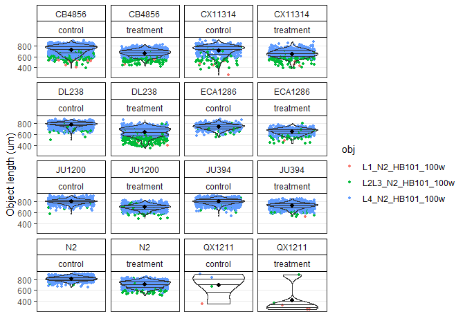
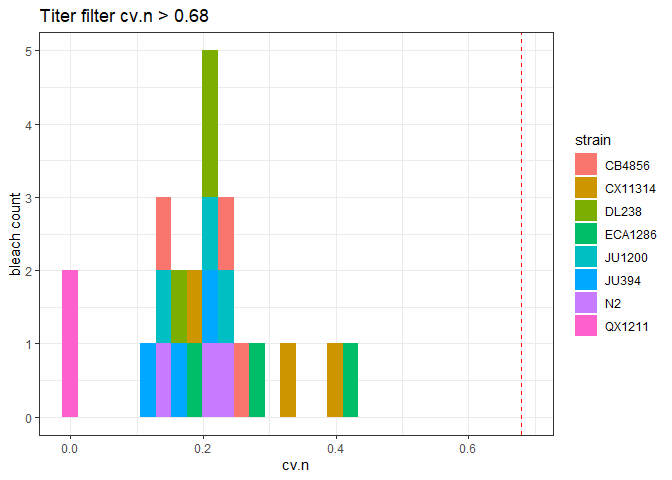
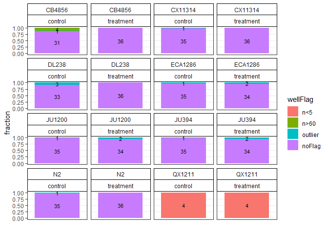
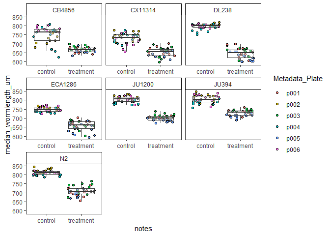

easyXpress 12 hours cold trial
================
Amanda Peake
2024-12-17

# R version and packages needed

``` r
R.Version()$version.string
```

    ## [1] "R version 4.4.0 (2024-04-24 ucrt)"

``` r
#easyXpress
#devtools::install_github("AndersenLab/easyXpress")

library(easyXpress)
library(tidyverse)
```

    ## Warning: package 'tidyverse' was built under R version 4.4.1

    ## Warning: package 'ggplot2' was built under R version 4.4.3

    ## Warning: package 'readr' was built under R version 4.4.1

    ## Warning: package 'stringr' was built under R version 4.4.3

    ## Warning: package 'forcats' was built under R version 4.4.1

    ## Warning: package 'lubridate' was built under R version 4.4.1

    ## ── Attaching core tidyverse packages ──────────────────────── tidyverse 2.0.0 ──
    ## ✔ dplyr     1.1.4     ✔ readr     2.1.5
    ## ✔ forcats   1.0.0     ✔ stringr   1.5.1
    ## ✔ ggplot2   3.5.2     ✔ tibble    3.2.1
    ## ✔ lubridate 1.9.3     ✔ tidyr     1.3.1
    ## ✔ purrr     1.0.2     
    ## ── Conflicts ────────────────────────────────────────── tidyverse_conflicts() ──
    ## ✖ dplyr::filter() masks stats::filter()
    ## ✖ dplyr::lag()    masks stats::lag()
    ## ℹ Use the conflicted package (<http://conflicted.r-lib.org/>) to force all conflicts to become errors

``` r
library(ggplot2)
library(agricolae)
library(lme4)
```

    ## Loading required package: Matrix
    ## 
    ## Attaching package: 'Matrix'
    ## 
    ## The following objects are masked from 'package:tidyr':
    ## 
    ##     expand, pack, unpack

``` r
library(dplyr)
library(caret)
```

    ## Warning: package 'caret' was built under R version 4.4.3

    ## Loading required package: lattice
    ## 
    ## Attaching package: 'caret'
    ## 
    ## The following object is masked from 'package:purrr':
    ## 
    ##     lift

## Load data

``` r
#Read in data 
cold_12hrs_data <- easyXpress::readXpress(filedir = "C:/Users/amand/OneDrive - University of Toronto/Documents/Academics/PhD/Cold_worms/ImageXpress_assays/12hrscold/12hrscold/Analysis-20241127",
                                          rdafile = "NA_Analysis-20241127.RData",
                                          design = TRUE, 
                                          doseR = FALSE
                                          )
```

    ## You set doseR = FALSE. Not reading data as a dose reponse.

    ## 1 project detected:

    ## loading data from .rda:
    ## C:/Users/amand/OneDrive - University of Toronto/Documents/Academics/PhD/Cold_worms/ImageXpress_assays/12hrscold/12hrscold/Analysis-20241127/cp_data/NA_Analysis-20241127.RData

    ## Applying length threshold of 98.811 um.
    ## The number of filtered rows for each model are displayed below.

    ## 
    ## 
    ## |model              | total_rows| filtered|
    ## |:------------------|----------:|--------:|
    ## |L1_N2_HB101_100w   |      39508|       17|
    ## |L2L3_N2_HB101_100w |      23114|        0|
    ## |L4_N2_HB101_100w   |      19454|        0|
    ## |MDHD               |      48578|     1118|

    ## 

    ## Applying missing parent filter.
    ## The number of filtered rows for each model are displayed below.

    ## 
    ## 
    ## |model              | total_rows| filtered|
    ## |:------------------|----------:|--------:|
    ## |L1_N2_HB101_100w   |      39508|       21|
    ## |L2L3_N2_HB101_100w |      23114|        0|
    ## |L4_N2_HB101_100w   |      19454|        0|
    ## |MDHD               |      48578|       27|

    ## 

    ## Primary object attributes detected.
    ## Calculating `wo_po_area_frac`.

    ## Joining design file:
    ## C:/Users/amand/OneDrive - University of Toronto/Documents/Academics/PhD/Cold_worms/ImageXpress_assays/12hrscold/12hrscold/Analysis-20241127/design/20241212_12hrscold_design.csv

    ## DONE

``` r
#model selection
ms <- easyXpress::modelSelection(cold_12hrs_data$raw_data)
```

    ## Removing unnecessary '.model.outputs' suffix from model names

    ## Found 4 worm models in data.

    ## MDHD

    ## L1_N2_HB101_100w

    ## L2L3_N2_HB101_100w

    ## L4_N2_HB101_100w

## Flag objects

``` r
#flag objects that are close to the edge of the well that are difficult to segment properly
ef <- edgeOF(data = ms)

#flag objects that are found within the same primary object which are often debris or improperly segmented worms
cf <- clusterOF(data = ef)
```

Check proportion of flags in each plate

``` r
#Check flags
c1 <- checkOF(data = cf, strain, notes)
```

    ## 2 ObjectFlags detected in data. They were applied in the following order:

    ## edge_ObjectFlag

    ## cluster_ObjectFlag

    ## The data are summarized by: strain, notes

    ## Returning list with elements d (the summary data frame) and p (the summary plot)

``` r
c1$p
```

<!-- -->

Check distribution of object length for each plate

``` r
#visualize size distribution of the ojbect by grouping variables
c2 <- checkObjs(data = cf, OF = "filter", strain, notes)
```

    ## 2 ObjectFlags detected in data. They were applied in the following order:

    ## edge_ObjectFlag

    ## cluster_ObjectFlag

    ## The flagged objects will be filtered from the plot.

``` r
c2
```

<!-- -->

Check if small objects are debris

``` r
#Add variables that describe the PATH to processed images and well labels
cm <- cf %>%
  dplyr::mutate(i.dir = dplyr::case_when(Metadata_Experiment == "cold12hrs" ~ "C:/Users/amand/OneDrive - University of Toronto/Documents/Academics/PhD/Cold_worms/ImageXpress_assays/12hrscold/12hrscold/Analysis-20241127/processed_images/", 
                                         TRUE ~ NA_character_), 
                w.lab = paste(Metadata_Plate, strain, sep = "_"))

#Check models 
# cm.out <- checkModels(data = cm, 
#                       Metadata_Experiment, Metadata_Plate, 
#                       proc.img.dir = "i.dir", 
#                       well.label = "w.lab", 
#                       out.dir = "C:/Users/amand/OneDrive - University of Toronto/Documents/Academics/PhD/Cold_worms/ImageXpress_assays/12hrscold/12hrscold/Analysis-20241127/checkModels/out/")
```

Remove objects less than 100um and MDHD

``` r
#add the user variable that will be converted into a flag
u = cm %>%
  dplyr::mutate(user = dplyr::case_when(worm_length_um < 165 ~ "junk",
                                        model == "MDHD" ~ "junk",
                                        #strain == "QX1211" ~ "junk", #QX1211 wells did not have any worms in them
                                        TRUE ~ NA_character_))

#specify user variable as the flag 
uf <- easyXpress::userOF(data= u, user)
```

    ## Converting user into an easyXpress compatible object flag (OF).

``` r
#check data again
checkObjs(data = uf, OF = "filter", strain, notes)
```

    ## 3 ObjectFlags detected in data. They were applied in the following order:

    ## edge_ObjectFlag

    ## cluster_ObjectFlag

    ## user_ObjectFlag

    ## The flagged objects will be filtered from the plot.

<!-- -->

Flag objects with extreme worm values

``` r
#flags objects with extremely large worm_length-um values
o <- easyXpress::outlierOF(data = uf)
```

    ## Previously flagged objects will not be used when calcualting outliers. This is the recommended approach.

    ## 3 ObjectFlags detected in data. They were applied in the following order:

    ## edge_ObjectFlag

    ## cluster_ObjectFlag

    ## user_ObjectFlag

    ## Flagging outlier objects in each well if worm_length_um is outside the range: median +/- (1.5*IQR)

``` r
#check objects
checkObjs(data = o, OF = 'filter', strain, notes)
```

    ## 4 ObjectFlags detected in data. They were applied in the following order:

    ## edge_ObjectFlag

    ## cluster_ObjectFlag

    ## user_ObjectFlag

    ## outlier_ObjectFlag

    ## The flagged objects will be filtered from the plot.

<!-- -->

``` r
#check propotion of flags
co2 <- checkOF(data = o, strain, notes)
```

    ## 4 ObjectFlags detected in data. They were applied in the following order:

    ## edge_ObjectFlag

    ## cluster_ObjectFlag

    ## user_ObjectFlag

    ## outlier_ObjectFlag

    ## The data are summarized by: strain, notes

    ## Returning list with elements d (the summary data frame) and p (the summary plot)

``` r
co2
```

    ## $d
    ## # A tibble: 78 × 8
    ##    strain notes     grouping    objectFlag objectFlag_group_perc grand_n group_n
    ##    <chr>  <chr>     <chr>       <fct>                      <dbl>   <int>   <int>
    ##  1 CB4856 control   strain, no… edge                     0.155     23932    2844
    ##  2 CB4856 control   strain, no… cluster                  0.230     23932    2844
    ##  3 CB4856 control   strain, no… junk                     0.00668   23932    2844
    ##  4 CB4856 control   strain, no… outlier                  0.0306    23932    2844
    ##  5 CB4856 control   strain, no… noFlag                   0.577     23932    2844
    ##  6 CB4856 treatment strain, no… edge                     0.156     23932    2750
    ##  7 CB4856 treatment strain, no… cluster                  0.242     23932    2750
    ##  8 CB4856 treatment strain, no… junk                     0.0135    23932    2750
    ##  9 CB4856 treatment strain, no… outlier                  0.0222    23932    2750
    ## 10 CB4856 treatment strain, no… noFlag                   0.566     23932    2750
    ## # ℹ 68 more rows
    ## # ℹ 1 more variable: objectFlag_n <int>
    ## 
    ## $p

<!-- -->

View wells to see what data is worth keeping

``` r
#set seed to select 8 random flagged well with flags
set.seed(99)

#set the flags and filter data
o2 <- easyXpress::setOF(data = o) %>%
  #randomly sample 8 wells
  dplyr::filter(well.id %in% sample(well.id, size = 8))
```

    ## 4 ObjectFlags detected in data. They were applied in the following order:

    ## edge_ObjectFlag

    ## cluster_ObjectFlag

    ## user_ObjectFlag

    ## outlier_ObjectFlag

    ## The flagged objects are labelled in the objectFlag variable.

``` r
#make overlay
 vo1 <- easyXpress::viewOverlay(data = o2,
                         proc.img.dir = "i.dir",
                         well.label = "w.lab",
                         obj.label = "model",
                         text.anno = "objectFlag",
                         # save to example dir
                         file = "C:/Users/amand/OneDrive - University of Toronto/Documents/Academics/PhD/Cold_worms/ImageXpress_assays/12hrscold/12hrscold/Analysis-20241127/viewOverlay/overlay.png")
```

    ## Making grob list for 8 overlays

    ## Making plot for 8 overlays

    ## Saving plot as: C:/Users/amand/OneDrive - University of Toronto/Documents/Academics/PhD/Cold_worms/ImageXpress_assays/12hrscold/12hrscold/Analysis-20241127/viewOverlay/overlay.png

remove all flagged object from the data

``` r
#processed object dataset
proc.objs <- easyXpress::filterOF(o, rmVars = TRUE)
```

    ## 4 ObjectFlags detected in data. They were applied in the following order:

    ## edge_ObjectFlag

    ## cluster_ObjectFlag

    ## user_ObjectFlag

    ## outlier_ObjectFlag

\##Flag wells

NOTE: did not check for variation between bleaches because all
measurements were taken from the same bleach prep.

Remove flagged objects, summarize data within each well and drop all
object related variables from the data to prepare for flagging wells.

``` r
raw.wells <- easyXpress::summarizeWells(data = o)
```

    ## 4 ObjectFlags detected in data. They were applied in the following order:

    ## edge_ObjectFlag

    ## cluster_ObjectFlag

    ## user_ObjectFlag

    ## outlier_ObjectFlag

    ## All flagged objects are filtered prior to summarizing wells.

    ## The standard object variables are dropped from the summarized data.

Flag wells that have too many or too few objects in them

``` r
#Make a tf dataframe 
tf <- easyXpress::titerWF(data = raw.wells,
                          Metadata_Experiment, bleach, strain, replicate,
                          doseR = FALSE)
```

    ## You set doseR = FALSE. Not expecting controls to be coded for a dose reponse.

    ## 23 independent bleaches detected. The titer_WellFlag is set in the output data.

    ## A diagnostic plot for checking cv.n threshold is returned. See ?titerWF() for more details.

``` r
#check the number of objects in each well
n <- easyXpress::nWF(data = tf$d, strain, notes, max = 60, min = 3)
```

    ## The n_WellFlag is set in the output data.

    ## A diagnostic plot for checking the object number thresholds (max, min) is returned. See <out>$.p

``` r
n$p
```

<!-- -->

``` r
#flag wells with extreme outlier values
ow <- easyXpress::outlierWF(data = n$d, 
                            Metadata_Experiment, strain, replicate, notes)
```

    ## Previously flagged wells will not be used when calcualting outliers within the group. This is the recommended approach.

    ## 2 WellFlags detected in data. They were applied in the following order:

    ## titer_WellFlag

    ## n_WellFlag

    ## Flagging outlier wells in group if median_wormlength_um is outside the range: median +/- (1.5*IQR)

``` r
#check flagged outlier wells by control vs treatment
cw1 <- easyXpress::checkWF(data = ow, strain, notes)
```

    ## 3 WellFlags detected in data. They were applied in the following order:

    ## titer_WellFlag

    ## n_WellFlag

    ## outlier_WellFlag

    ## The data are summarized by: strain, notes

    ## Returning list with elements d (the summary data frame) and p (the summary plot)

``` r
cw1$p
```

<!-- -->

``` r
#check flagged outlier wells be plate
cw2 <- easyXpress::checkWF(data = ow, strain, replicate)
```

    ## 3 WellFlags detected in data. They were applied in the following order:

    ## titer_WellFlag

    ## n_WellFlag

    ## outlier_WellFlag

    ## The data are summarized by: strain, replicate

    ## Returning list with elements d (the summary data frame) and p (the summary plot)

``` r
cw2$p
```

<!-- -->

Remove all flagged wells from the data NOTE: removed QX1211 because of
low embryo yield during filtration.

``` r
#remove wells
fw <- filterWF(data = ow, rmVars = TRUE)
```

    ## 3 WellFlags detected in data. They were applied in the following order:

    ## titer_WellFlag

    ## n_WellFlag

    ## outlier_WellFlag

``` r
#check balance to see fraction retained after flags are filtered
cb <- checkBalance(data = fw, strain, notes, 
                   design = cold_12hrs_data$design, 
                   x = replicate)
```

    ## Joining with `by = join_by(well.id, replicate, strain, notes)`

    ## Returning list with elements d (the summary data frame) and p (the summary plot)

``` r
cb$p
```

<!-- -->

``` r
#remove QX1211 
drop <- fw %>%
  dplyr::mutate(b.filter =
                  dplyr::case_when(strain == "QX1211" ~  "drop",
                                   TRUE ~ "keep")) %>%
  dplyr::filter(b.filter == "keep") %>%
  dplyr::select(-b.filter)


#check data after removing problematic strains or plates
ce1 <- easyXpress::checkEff(data = drop, strain, 
                            x = notes, 
                            y = median_wormlength_um, 
                            fill = Metadata_Plate, 
                            scales = "free_x"
                           )
```

    ## Warning: Using `as.character()` on a quosure is deprecated as of rlang 0.3.0. Please use
    ## `as_label()` or `as_name()` instead.
    ## This warning is displayed once every 8 hours.

``` r
ce1
```

<!-- -->

## Finalize results

Account for differences between replicates

``` r
#regress the effect of independent plates (eg. blocks) for each strain
drop$replicate <- as.character(drop$replicate)

reg <- easyXpress::regEff(data = drop,
                          d.var = median_wormlength_um, #dependent variable
                          c.var = replicate
                          )
```

    ## The dependent variable `median_wormlength_um` is class numeric. Please ensure this is correct.

    ## The confounding variable `replicate` is class character. Please ensure this is correct.

    ## The data are grouped by: ``

``` r
reg$p2
```

<!-- -->

Calculate difference between control and treatment. delta() calculates
the difference in well summary statistics between the experimental
condition and the median control condition within a group.

``` r
#Calculate difference
del <- easyXpress::delta(data = reg$d, 
                         replicate, strain, 
                         WF = "filter", 
                        vars = c("median_wormlength_um_reg"),
                         doseR = FALSE)
```

    ## You set doseR = FALSE. Not expecting controls to be coded for a dose reponse.

    ## No flagged wells detected.

    ## The data are grouped by, replicate, strain.

    ## The mean control value within groups has been subtracted from the well summary statstics:

    ## median_wormlength_um_reg

``` r
#write del to csv to be used in manuscript visualisation script
#write.csv(del, file = "C:/Users/amand/OneDrive - University of Toronto/Documents/Academics/PhD/Cold_worms/12hours_delta_df.csv", row.names = FALSE)
```

Make a dataframe to compared treatment deltas

``` r
#Make dataframe
treatment_df <- subset(del, del$notes == "treatment")

#run an anova to test for differences between strains
strain_annova <- aov(median_wormlength_um_reg_delta ~ strain, data = treatment_df)
summary(strain_annova)
```

    ##              Df Sum Sq Mean Sq F value Pr(>F)    
    ## strain        6 141055   23509   31.98 <2e-16 ***
    ## Residuals   239 175718     735                   
    ## ---
    ## Signif. codes:  0 '***' 0.001 '**' 0.01 '*' 0.05 '.' 0.1 ' ' 1

``` r
#Tukey HSD 
strain_tukey <- HSD.test(strain_annova, trt = "strain")
strain_tukey
```

    ## $statistics
    ##    MSerror  Df      Mean       CV
    ##   735.2206 239 -98.29991 -27.5839
    ## 
    ## $parameters
    ##    test name.t ntr StudentizedRange alpha
    ##   Tukey strain   7         4.205353  0.05
    ## 
    ## $means
    ##         median_wormlength_um_reg_delta      std  r       se       Min
    ## CB4856                       -84.70284 30.05978 36 4.519158 -148.8300
    ## CX11314                      -78.15081 23.20555 36 4.519158 -136.1157
    ## DL238                       -150.94180 28.69266 36 4.519158 -199.1405
    ## ECA1286                      -90.19707 28.95854 34 4.650176 -158.1236
    ## JU1200                      -102.71764 23.06381 34 4.650176 -134.8557
    ## JU394                        -76.49751 24.91077 34 4.650176 -123.1706
    ## N2                          -103.47574 29.62842 36 4.519158 -167.5298
    ##                Max        Q25        Q50        Q75
    ## CB4856   -41.34402 -112.76191  -74.92801  -65.00935
    ## CX11314  -37.50132  -97.31219  -73.85352  -63.55469
    ## DL238   -105.89197 -175.65984 -154.41293 -125.39561
    ## ECA1286  -46.06930 -104.62577  -84.48195  -70.93257
    ## JU1200   -47.76121 -118.29747 -110.02865  -80.37963
    ## JU394    -36.69046  -96.30632  -79.57277  -52.02046
    ## N2       -35.82861 -121.24583 -106.09568  -91.07645
    ## 
    ## $comparison
    ## NULL
    ## 
    ## $groups
    ##         median_wormlength_um_reg_delta groups
    ## JU394                        -76.49751      a
    ## CX11314                      -78.15081      a
    ## CB4856                       -84.70284     ab
    ## ECA1286                      -90.19707     ab
    ## JU1200                      -102.71764      b
    ## N2                          -103.47574      b
    ## DL238                       -150.94180      c
    ## 
    ## attr(,"class")
    ## [1] "group"

Calculate broad sense heritability

Heritability = 637.93/(637.93 + 735.21) = 0.46

``` r
#mixed model 
H_strain_model <- lmer(median_wormlength_um_reg_delta ~ (1|strain), data = treatment_df)
summary(H_strain_model)
```

    ## Linear mixed model fit by REML ['lmerMod']
    ## Formula: median_wormlength_um_reg_delta ~ (1 | strain)
    ##    Data: treatment_df
    ## 
    ## REML criterion at convergence: 2338.5
    ## 
    ## Scaled residuals: 
    ##      Min       1Q   Median       3Q      Max 
    ## -2.49559 -0.67900  0.04817  0.74278  2.48870 
    ## 
    ## Random effects:
    ##  Groups   Name        Variance Std.Dev.
    ##  strain   (Intercept) 637.9    25.26   
    ##  Residual             735.2    27.11   
    ## Number of obs: 246, groups:  strain, 7
    ## 
    ## Fixed effects:
    ##             Estimate Std. Error t value
    ## (Intercept)  -98.104      9.702  -10.11

``` r
vc <- VarCorr(H_strain_model)
print(vc,comp=c("Variance"))
```

    ##  Groups   Name        Variance
    ##  strain   (Intercept) 637.93  
    ##  Residual             735.21

Make a box plot to compare median deltas

``` r
#Set order of strains based on sampling latitude 
treatment_df$strain <- factor(treatment_df$strain, levels = c("ECA1286", "DL238", "CB4856", "CX11314", "JU394", "N2", "JU1200"), ordered = TRUE)

#Make dataframe for tukey groupings for the plot 
plot_tukey_groups <- merge(strain_tukey$means, strain_tukey$groups, by = "row.names")


#Box plot comparing median deltas for each strain
treatment_delta_plot <- ggplot(treatment_df, aes(x = strain, y = median_wormlength_um_reg_delta)) + 
  geom_boxplot(outlier.shape = NA) +
  #geom_violin() +
  geom_jitter(shape=16, position=position_jitter(0.2), aes(color = replicate)) + 
  ggtitle("A) 12 hrs at 4°C") + 
  xlab("strain ordered by latitude") + 
  ylab("Δ median length per well") +
  theme_classic() + 
  theme(plot.title = element_text(size=16, face = "bold")) + 
  geom_text(data=plot_tukey_groups, aes(x= Row.names, y = Q75, label = groups), size =5, vjust = -1.25, hjust =-1)
  
treatment_delta_plot
```

<!-- -->

``` r
#Box plots not colored by replicate 
treatment_delta_plot <- ggplot(treatment_df, aes(x = strain, y = median_wormlength_um_reg_delta)) + 
  geom_boxplot(outlier.shape = NA) +
  #geom_violin() +
  geom_jitter(shape=16, position=position_jitter(0.2)) + 
  ggtitle("A) 12 hrs at 4°C") + 
  xlab("strain ordered by latitude") + 
  ylab("Δ median length per well") +
  theme_classic() + 
  theme(plot.title = element_text(size=16, face = "bold")) + 
  geom_text(data=plot_tukey_groups, aes(x= Row.names, y = Q75, label = groups), size =5, vjust = -1.25, hjust =-1.25, color = "blue")
  
treatment_delta_plot
```

<!-- -->
