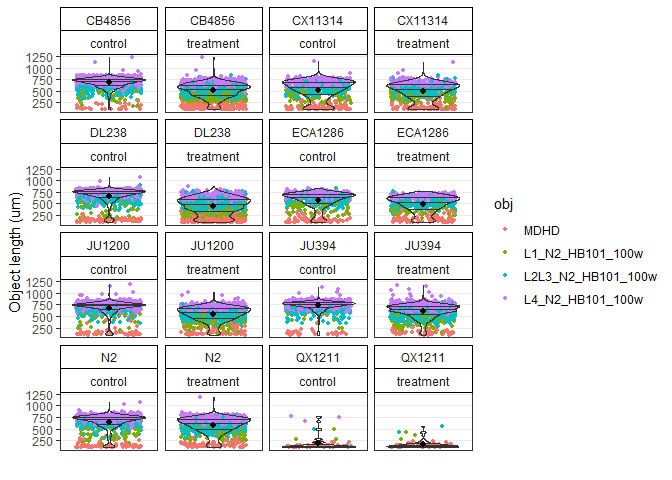
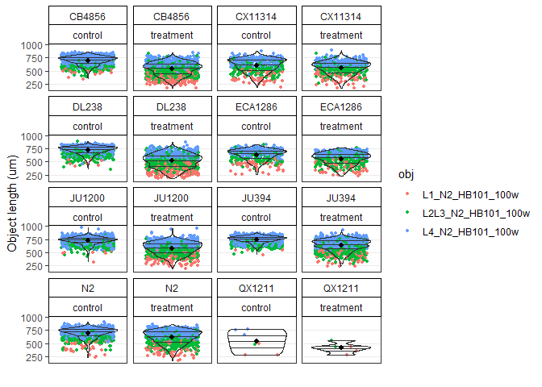
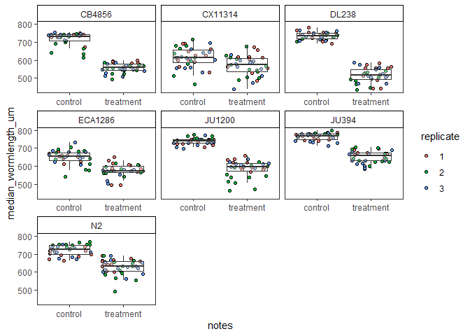

easyXpress 24 hours cold trial
================
Amanda Peake
2024-12-17

# R version and packages needed

## Load data

``` r
#Read in data 
cold_24hrs_data <- easyXpress::readXpress(filedir = "C:/Users/amand/OneDrive - University of Toronto/Documents/Academics/PhD/Cold_worms/ImageXpress_assays/24hrscold/24hrscold/Analysis-20241202",
                                          rdafile = "NA_Analysis-20241202.RData",
                                          design = TRUE, 
                                          doseR = FALSE
                                          )
## You set doseR = FALSE. Not reading data as a dose reponse.
## 1 project detected:
## loading data from .rda:
## C:/Users/amand/OneDrive - University of Toronto/Documents/Academics/PhD/Cold_worms/ImageXpress_assays/24hrscold/24hrscold/Analysis-20241202/cp_data/NA_Analysis-20241202.RData
## Applying length threshold of 98.811 um.
## The number of filtered rows for each model are displayed below.
## 
## 
## |model              | total_rows| filtered|
## |:------------------|----------:|--------:|
## |L1_N2_HB101_100w   |      36290|       39|
## |L2L3_N2_HB101_100w |      20455|        1|
## |L4_N2_HB101_100w   |      12912|        0|
## |MDHD               |      50194|     2043|
## 
## Applying missing parent filter.
## The number of filtered rows for each model are displayed below.
## 
## 
## |model              | total_rows| filtered|
## |:------------------|----------:|--------:|
## |L1_N2_HB101_100w   |      36290|       27|
## |L2L3_N2_HB101_100w |      20455|        0|
## |L4_N2_HB101_100w   |      12912|        0|
## |MDHD               |      50194|       41|
## 
## Primary object attributes detected.
## Calculating `wo_po_area_frac`.
## Joining design file:
## C:/Users/amand/OneDrive - University of Toronto/Documents/Academics/PhD/Cold_worms/ImageXpress_assays/24hrscold/24hrscold/Analysis-20241202/design/20241212_24hrscold_design.csv
## DONE
```

``` r


#model selection
ms <- easyXpress::modelSelection(cold_24hrs_data$raw_data)
## Removing unnecessary '.model.outputs' suffix from model names
## Found 4 worm models in data.
## MDHD
## L1_N2_HB101_100w
## L2L3_N2_HB101_100w
## L4_N2_HB101_100w
```

## Flag objects

``` r
#flag objects that are close to the edge of the well that are difficult to segment properly
ef <- edgeOF(data = ms)

#flag objects that are found within the same primary object which are often debris or improperly segmented worms
cf <- clusterOF(data = ef)
```

Check proportion of flags in each plate

``` r
#Check flags
c1 <- checkOF(data = cf, strain, notes)
## 2 ObjectFlags detected in data. They were applied in the following order:
## edge_ObjectFlag
## cluster_ObjectFlag
## The data are summarized by: strain, notes
## Returning list with elements d (the summary data frame) and p (the summary plot)
```

``` r
c1$p
```

<!-- -->

Check distribution of object length for each plate

``` r
#visualize size distribution of the ojbect by grouping variables
c2 <- checkObjs(data = cf, OF = "filter", strain, notes)
## 2 ObjectFlags detected in data. They were applied in the following order:
## edge_ObjectFlag
## cluster_ObjectFlag
## The flagged objects will be filtered from the plot.
```

``` r
c2
```

<!-- -->

Check if small objects are debris

``` r
#Add variables that describe the PATH to processed images and well labels
cm <- cf %>%
  dplyr::mutate(i.dir = dplyr::case_when(Metadata_Experiment == "cold24hrs" ~ "C:/Users/amand/OneDrive - University of Toronto/Documents/Academics/PhD/Cold_worms/ImageXpress_assays/24hrscold/24hrscold/Analysis-20241202/processed_images/processed_images/", 
                                         TRUE ~ NA_character_), 
                w.lab = paste(Metadata_Plate, strain, sep = "_"))

#Check models 
#cm.out <- checkModels(data = cm, 
#                      Metadata_Experiment, Metadata_Plate, 
#                      proc.img.dir = "i.dir", 
#                     well.label = "w.lab", 
#                       out.dir = "C:/Users/amand/OneDrive - University of Toronto/Documents/Academics/PhD/Cold_worms/ImageXpress_assays/24hrscold/24hrscold/Analysis-20241202/checkModels/out/")
#
#
```

Remove objects less than 100um and MDHD

``` r
#add the user variable that will be converted into a flag
u = cm %>%
  dplyr::mutate(user = dplyr::case_when(worm_length_um < 165 ~ "junk",
                                        model == "MDHD" ~ "junk",
                                        #strain == "QX1211" ~ "junk", #QX1211 wells did not have any worms in them
                                        TRUE ~ NA_character_))

#specify user variable as the flag 
uf <- easyXpress::userOF(data= u, user)
## Converting user into an easyXpress compatible object flag (OF).
```

``` r

#check data again
checkObjs(data = uf, OF = "filter", strain, notes)
## 3 ObjectFlags detected in data. They were applied in the following order:
## edge_ObjectFlag
## cluster_ObjectFlag
## user_ObjectFlag
## The flagged objects will be filtered from the plot.
```

<!-- -->

Flag objects with extreme worm values

``` r
#flags objects with extremely large worm_length-um values
o <- easyXpress::outlierOF(data = uf)
## Previously flagged objects will not be used when calcualting outliers. This is the recommended approach.
## 3 ObjectFlags detected in data. They were applied in the following order:
## edge_ObjectFlag
## cluster_ObjectFlag
## user_ObjectFlag
## Flagging outlier objects in each well if worm_length_um is outside the range: median +/- (1.5*IQR)
```

``` r

#check objects
checkObjs(data = o, OF = 'filter', strain, notes)
## 4 ObjectFlags detected in data. They were applied in the following order:
## edge_ObjectFlag
## cluster_ObjectFlag
## user_ObjectFlag
## outlier_ObjectFlag
## The flagged objects will be filtered from the plot.
```

<!-- -->

``` r

#check propotion of flags
co2 <- checkOF(data = o, strain, notes)
## 4 ObjectFlags detected in data. They were applied in the following order:
## edge_ObjectFlag
## cluster_ObjectFlag
## user_ObjectFlag
## outlier_ObjectFlag
## The data are summarized by: strain, notes
## Returning list with elements d (the summary data frame) and p (the summary plot)
```

``` r
co2
## $d
## # A tibble: 78 × 8
##    strain notes     grouping    objectFlag objectFlag_group_perc grand_n group_n
##    <chr>  <chr>     <chr>       <fct>                      <dbl>   <int>   <int>
##  1 CB4856 control   strain, no… edge                     0.145     24983    2810
##  2 CB4856 control   strain, no… cluster                  0.249     24983    2810
##  3 CB4856 control   strain, no… junk                     0.0107    24983    2810
##  4 CB4856 control   strain, no… outlier                  0.0263    24983    2810
##  5 CB4856 control   strain, no… noFlag                   0.569     24983    2810
##  6 CB4856 treatment strain, no… edge                     0.180     24983    2833
##  7 CB4856 treatment strain, no… cluster                  0.153     24983    2833
##  8 CB4856 treatment strain, no… junk                     0.0515    24983    2833
##  9 CB4856 treatment strain, no… outlier                  0.00494   24983    2833
## 10 CB4856 treatment strain, no… noFlag                   0.610     24983    2833
## # ℹ 68 more rows
## # ℹ 1 more variable: objectFlag_n <int>
## 
## $p
```

<!-- -->

View wells to see what data is worth keeping

``` r
##set seed to select 8 random flagged well with flags
#set.seed(99)
#
##set the flags and filter data
#o2 <- easyXpress::setOF(data = o) %>%
#  #randomly sample 8 wells
#  dplyr::filter(well.id %in% sample(well.id, size = 8))
#
##make overlay
# vo1 <- easyXpress::viewOverlay(data = o2,
#                         proc.img.dir = "i.dir",
#                         well.label = "w.lab",
#                         obj.label = "model",
#                         text.anno = "objectFlag",
#                         # save to example dir
#                         file = "C:/Users/amand/OneDrive - University of Toronto/Documents/Academics/PhD/Cold_worms/ImageXpress_assays/24hrscold/24hrscold/Analysis-20241202/viewOverlay/overlay.png")
```

remove all flagged object from the data

``` r
#processed object dataset
proc.objs <- easyXpress::filterOF(o, rmVars = TRUE)
## 4 ObjectFlags detected in data. They were applied in the following order:
## edge_ObjectFlag
## cluster_ObjectFlag
## user_ObjectFlag
## outlier_ObjectFlag
```

## Flag wells

NOTE: did not check for variation between bleaches because all
measurements were taken from the same bleach prep.

Remove flagged objects, summarize data within each well and drop all
object related variables from the data to prepare for flagging wells.

``` r
raw.wells <- easyXpress::summarizeWells(data = o)
## 4 ObjectFlags detected in data. They were applied in the following order:
## edge_ObjectFlag
## cluster_ObjectFlag
## user_ObjectFlag
## outlier_ObjectFlag
## All flagged objects are filtered prior to summarizing wells.
## The standard object variables are dropped from the summarized data.
```

Flag wells that have too many or too few objects in them

``` r
#Make a tf dataframe 
tf <- easyXpress::titerWF(data = raw.wells,
                          Metadata_Experiment, bleach, strain, replicate,
                          doseR = FALSE)
## You set doseR = FALSE. Not expecting controls to be coded for a dose reponse.
## 24 independent bleaches detected. The titer_WellFlag is set in the output data.
## A diagnostic plot for checking cv.n threshold is returned. See ?titerWF() for more details.
```

``` r

tf$p
## Warning: Removed 1 row containing non-finite outside the scale range
## (`stat_bin()`).
```

<!-- -->

``` r

#check the number of objects in each well
n <- easyXpress::nWF(data = tf$d, strain, notes, max = 60, min = 5)
## The n_WellFlag is set in the output data.
## A diagnostic plot for checking the object number thresholds (max, min) is returned. See <out>$.p
```

``` r
n$p
```

<!-- -->

``` r

#flag wells with extreme outlier values
ow <- easyXpress::outlierWF(data = n$d, 
                            Metadata_Experiment, strain, replicate, notes)
## Previously flagged wells will not be used when calcualting outliers within the group. This is the recommended approach.
## 2 WellFlags detected in data. They were applied in the following order:
## titer_WellFlag
## n_WellFlag
## Flagging outlier wells in group if median_wormlength_um is outside the range: median +/- (1.5*IQR)
```

``` r

#check flagged outlier wells by control vs treatment
cw1 <- easyXpress::checkWF(data = ow, strain, notes)
## 3 WellFlags detected in data. They were applied in the following order:
## titer_WellFlag
## n_WellFlag
## outlier_WellFlag
## The data are summarized by: strain, notes
## Returning list with elements d (the summary data frame) and p (the summary plot)
```

``` r
cw1$p
```

<!-- -->

``` r

#check flagged outlier wells be plate
cw2 <- easyXpress::checkWF(data = ow, strain, replicate)
## 3 WellFlags detected in data. They were applied in the following order:
## titer_WellFlag
## n_WellFlag
## outlier_WellFlag
## The data are summarized by: strain, replicate
## Returning list with elements d (the summary data frame) and p (the summary plot)
```

``` r
cw2$p
```

<!-- -->

Remove all flagged wells from the data NOTE: removed QX1211 because of
low embryo yield during filtration.

``` r
#remove wells
fw <- filterWF(data = ow, rmVars = TRUE)
## 3 WellFlags detected in data. They were applied in the following order:
## titer_WellFlag
## n_WellFlag
## outlier_WellFlag
```

``` r

#check balance to see fraction retained after flags are filtered
cb <- checkBalance(data = fw, strain, notes, 
                   design = cold_24hrs_data$design, 
                   x = replicate)
## Joining with `by = join_by(well.id, replicate, strain, notes)`
## Returning list with elements d (the summary data frame) and p (the summary plot)
```

``` r
cb$p
```

<!-- -->

``` r

#remove QX1211 
drop <- fw %>%
  dplyr::mutate(b.filter =
                  dplyr::case_when(strain == "QX1211" ~  "drop",
                                   TRUE ~ "keep")) %>%
  dplyr::filter(b.filter == "keep") %>%
  dplyr::select(-b.filter)


#check data after removing problematic strains or plates
ce1 <- easyXpress::checkEff(data = drop, strain, 
                            x = notes, 
                            y = median_wormlength_um, 
                            fill = replicate, 
                            scales = "free_x"
                           )
## Warning: Using `as.character()` on a quosure is deprecated as of rlang 0.3.0. Please use
## `as_label()` or `as_name()` instead.
## This warning is displayed once every 8 hours.
```

``` r
ce1
```

<!-- -->

## Finalize results

Calculate difference between control and treatment. delta() calculates
the difference in well summary statistics between the experimental
condition and the median control condition within a group.

``` r
#Calculate difference between control wells and treatment
del <- easyXpress::delta(data = drop, 
                         replicate, strain, 
                         WF = "filter", 
                        vars = c("median_wormlength_um"),
                         doseR = FALSE)
## You set doseR = FALSE. Not expecting controls to be coded for a dose reponse.
## No flagged wells detected.
## The data are grouped by, replicate, strain.
## The mean control value within groups has been subtracted from the well summary statstics:
## median_wormlength_um
```

``` r


#Select columns needed for final dataframe 
finalized_delta_df <- del %>%
  dplyr::select(-drug, -concentration_um, -drug_prep_method, -i.dir, -flag_id, -Metadata_Group, -wo_po_area_frac, -assay_type, -food_conc_OD, -food_type, -diluent, -bleach, -well_censor, -well_censor_reason) %>%
  dplyr::rename("well ID" = well.id, 
                "Experiment" = Metadata_Experiment, 
                "Plate" = Metadata_Plate, 
                "Well" = Metadata_Well, 
                "Date" = Metadata_Date, 
                "Magnification" = Metadata_Magnification, 
                "Image" = FileName_RawBF, 
                "Strain" = strain, 
                "Treatment" = notes, 
                "Plate Design" = replicate, 
                "Well Strain" = w.lab, 
                "Mean wormlength (µm)" = mean_wormlength_um, 
                "Minimum wormlength (µm)" = min_wormlength_um, 
                "q10 wormlength (µm)" = q10_wormlength_um, 
                "q25 wormlength (µm)" = q25_wormlength_um, 
                "Median wormlength (µm)" = median_wormlength_um, 
                "Standard Deviation wormlength (µm)" = sd_wormlength_um, 
                "q75 wormlength (µm)" = q75_wormlength_um, 
                "q90 wormlength (µm)" = q90_wormlength_um, 
                "Maximum wormlength (µm)" = max_wormlength_um, 
                "Coefficient of variation wormlength (µm)" = cv_wormlength_um, 
                "Number of worms" = n, 
                "Control median wormlength (µm)" = control_median_wormlength_um, 
                "Delta median wormlength (µm)" = median_wormlength_um_delta
                )


#write del to csv to be used in manuscript visualisation script
write.csv(finalized_delta_df, file = "C:/Users/amand/OneDrive - University of Toronto/Documents/Academics/PhD/Cold_worms/24hours_manuscript_df.csv", row.names = FALSE)
```
