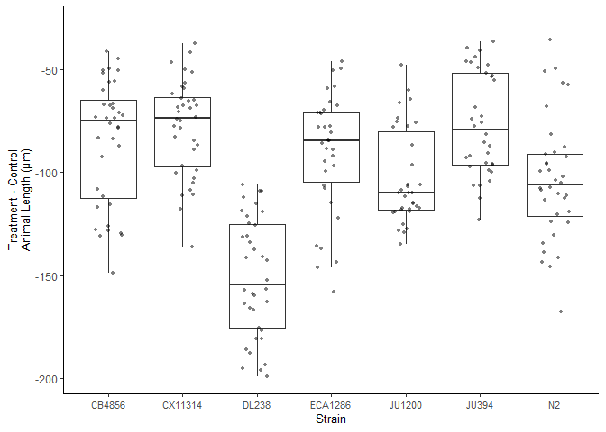
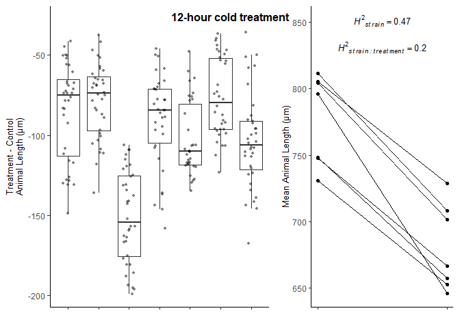

Cold tolerance micropub analysis and visulaizations
================
Amanda Peake
2025-07-25

## R version and packages needed

``` r
library(tidyverse)
```

    ## ── Attaching core tidyverse packages ──────────────────────── tidyverse 2.0.0 ──
    ## ✔ dplyr     1.1.4     ✔ readr     2.1.5
    ## ✔ forcats   1.0.0     ✔ stringr   1.5.1
    ## ✔ ggplot2   3.5.2     ✔ tibble    3.2.1
    ## ✔ lubridate 1.9.3     ✔ tidyr     1.3.1
    ## ✔ purrr     1.0.2     
    ## ── Conflicts ────────────────────────────────────────── tidyverse_conflicts() ──
    ## ✖ dplyr::filter() masks stats::filter()
    ## ✖ dplyr::lag()    masks stats::lag()
    ## ℹ Use the conflicted package (<http://conflicted.r-lib.org/>) to force all conflicts to become errors

``` r
library(ggplot2)
library(agricolae)
library(lme4)
```

    ## Loading required package: Matrix
    ## 
    ## Attaching package: 'Matrix'
    ## 
    ## The following objects are masked from 'package:tidyr':
    ## 
    ##     expand, pack, unpack

``` r
library(lmerTest)
```

    ## 
    ## Attaching package: 'lmerTest'
    ## 
    ## The following object is masked from 'package:lme4':
    ## 
    ##     lmer
    ## 
    ## The following object is masked from 'package:stats':
    ## 
    ##     step

``` r
library(dplyr)
library(ggpubr)
library(gridExtra)
```

    ## 
    ## Attaching package: 'gridExtra'
    ## 
    ## The following object is masked from 'package:dplyr':
    ## 
    ##     combine

``` r
library(cowplot)
```

    ## 
    ## Attaching package: 'cowplot'
    ## 
    ## The following object is masked from 'package:ggpubr':
    ## 
    ##     get_legend
    ## 
    ## The following object is masked from 'package:lubridate':
    ## 
    ##     stamp

``` r
library(car)
```

    ## Loading required package: carData
    ## 
    ## Attaching package: 'car'
    ## 
    ## The following object is masked from 'package:dplyr':
    ## 
    ##     recode
    ## 
    ## The following object is masked from 'package:purrr':
    ## 
    ##     some

Note: I checked that all warning msgs for “package \<…\> was built under
R version \<…\>” are backwards compatible with current R version (4.4.0)
according to packageDescription().

## Import data

``` r
#12 hour cold treatment
cold12hrs_delta_df <- read.csv("C:/Users/amand/OneDrive - University of Toronto/Documents/Academics/PhD/Cold_worms/12hours_manuscript_df.csv", header=TRUE)

#24 hour cold treatment
cold24hrs_delta_df <- read.csv("C:/Users/amand/OneDrive - University of Toronto/Documents/Academics/PhD/Cold_worms/24hours_manuscript_df.csv", header=TRUE)
```

## Make functions

Change some dataframe columns from being human readable to be more
machine friendly

``` r
format_colnames <- function(dataframe) { 
  dataframe %>% 
  dplyr::rename(Well_id = well.ID, 
                Plate_design = Plate.Design, 
                Well_strain = Well.Strain, 
                mean_wormlength_um = Mean.wormlength..µm.,
                min_wormlength_um = Minimum.wormlength..µm., 
                q10_wormlength_um = q10.wormlength..µm., 
                q25_wormlength_um = q25.wormlength..µm., 
                median_wormlength_um = Median.wormlength..µm., 
                sd_wormlength_um = Standard.Deviation.wormlength..µm., 
                q75_wormlength_um = q75.wormlength..µm., 
                q90_wormlength_um = q90.wormlength..µm., 
                max_wormlength_um = Maximum.wormlength..µm.,
                cv_wormlength_um = Coefficient.of.variation.wormlength..µm., 
                n = Number.of.worms, 
                control_median_wormlength_um = Control.median.wormlength..µm., 
                median_wormlength_um_delta = Delta.median.wormlength..µm.
  )
}
```

Get rank order delta values

``` r
rank_order_delta <- function(dataframe) {
  dataframe  %>% 
    dplyr::filter(Treatment == "treatment") %>% 
    dplyr::group_by(Strain) %>% 
    dplyr::summarise(
      delta_mean = mean(median_wormlength_um_delta, na.rm = TRUE), 
      delta_median = median(median_wormlength_um_delta, na.rm = TRUE)) %>% 
    dplyr::arrange(delta_mean)
}
```

Get rank order control values

``` r
rank_order_control <- function(dataframe) {
  dataframe  %>% 
    dplyr::filter(Treatment == "control") %>% 
    dplyr::group_by(Strain) %>% 
    dplyr::summarise(
      control_mean = mean(median_wormlength_um, na.rm = TRUE), 
      control_median = median(median_wormlength_um, na.rm = TRUE)) %>% 
    dplyr::arrange(control_mean)
}
```

## Get values for results section

Format column names

``` r
cold12hrs_delta_df <- format_colnames(cold12hrs_delta_df)
cold24hrs_delta_df <- format_colnames(cold24hrs_delta_df)
```

Rank order of delta

``` r
#12 hours
rank_delta_12hrs <- rank_order_delta(cold12hrs_delta_df)
rank_delta_12hrs
```

    ## # A tibble: 7 × 3
    ##   Strain  delta_mean delta_median
    ##   <chr>        <dbl>        <dbl>
    ## 1 DL238       -151.        -154. 
    ## 2 N2          -103.        -106. 
    ## 3 JU1200      -103.        -110. 
    ## 4 ECA1286      -90.2        -84.5
    ## 5 CB4856       -84.7        -74.9
    ## 6 CX11314      -78.2        -73.9
    ## 7 JU394        -76.5        -79.6

``` r
#24 hours
rank_delta_24hrs <- rank_order_delta(cold24hrs_delta_df)
rank_delta_24hrs
```

    ## # A tibble: 7 × 3
    ##   Strain  delta_mean delta_median
    ##   <chr>        <dbl>        <dbl>
    ## 1 DL238       -218.        -219. 
    ## 2 CB4856      -162.        -165. 
    ## 3 JU1200      -155.        -143. 
    ## 4 JU394       -112.        -110. 
    ## 5 N2           -93.2        -91.5
    ## 6 ECA1286      -74.0        -75.2
    ## 7 CX11314      -43.0        -35.1

Rank order of control

``` r
#12 hours
rank_control_12hrs <- rank_order_control(cold12hrs_delta_df)
rank_control_12hrs
```

    ## # A tibble: 7 × 3
    ##   Strain  control_mean control_median
    ##   <chr>          <dbl>          <dbl>
    ## 1 CX11314         731.           734.
    ## 2 CB4856          748.           766.
    ## 3 ECA1286         748.           748.
    ## 4 DL238           796.           800.
    ## 5 JU1200          804.           806.
    ## 6 JU394           805.           804.
    ## 7 N2              812.           812.

``` r
#24 hours
rank_control_24hrs <- rank_order_control(cold24hrs_delta_df)
rank_control_24hrs
```

    ## # A tibble: 7 × 3
    ##   Strain  control_mean control_median
    ##   <chr>          <dbl>          <dbl>
    ## 1 CX11314         614.           613.
    ## 2 ECA1286         650.           653.
    ## 3 CB4856          718.           733.
    ## 4 N2              722.           726.
    ## 5 DL238           734.           736.
    ## 6 JU1200          739.           741.
    ## 7 JU394           763.           768.

Run a spearman rank correlation for control length vs treatment delta.

``` r
#Make correlation test dataframes
cor_12hrs_df <- merge(rank_control_12hrs, rank_delta_12hrs, by = "Strain")
cor_24hrs_df <- merge(rank_control_24hrs, rank_delta_24hrs, by = "Strain")
###cor_1wk_df <- merge(rank_control_1wk, rank_delta_1wk, by = "Strain")

#12 hours - correlation and scatter plot
cor.test(cor_12hrs_df$control_mean, cor_12hrs_df$delta_mean, method = "spearman")
```

    ## 
    ##  Spearman's rank correlation rho
    ## 
    ## data:  cor_12hrs_df$control_mean and cor_12hrs_df$delta_mean
    ## S = 74, p-value = 0.4976
    ## alternative hypothesis: true rho is not equal to 0
    ## sample estimates:
    ##        rho 
    ## -0.3214286

``` r
cor.test(cor_12hrs_df$control_mean, cor_12hrs_df$delta_mean, method = "pearson")
```

    ## 
    ##  Pearson's product-moment correlation
    ## 
    ## data:  cor_12hrs_df$control_mean and cor_12hrs_df$delta_mean
    ## t = -1.0712, df = 5, p-value = 0.333
    ## alternative hypothesis: true correlation is not equal to 0
    ## 95 percent confidence interval:
    ##  -0.8941780  0.4758246
    ## sample estimates:
    ##        cor 
    ## -0.4320457

``` r
#24 hours - correlation and scatter plot
cor.test(cor_24hrs_df$control_mean, cor_24hrs_df$delta_mean, method = "spearman")
```

    ## 
    ##  Spearman's rank correlation rho
    ## 
    ## data:  cor_24hrs_df$control_mean and cor_24hrs_df$delta_mean
    ## S = 88, p-value = 0.2
    ## alternative hypothesis: true rho is not equal to 0
    ## sample estimates:
    ##        rho 
    ## -0.5714286

``` r
cor.test(cor_24hrs_df$control_mean, cor_24hrs_df$delta_mean, method = "pearson")
```

    ## 
    ##  Pearson's product-moment correlation
    ## 
    ## data:  cor_24hrs_df$control_mean and cor_24hrs_df$delta_mean
    ## t = -2.1407, df = 5, p-value = 0.08525
    ## alternative hypothesis: true correlation is not equal to 0
    ## 95 percent confidence interval:
    ##  -0.9499099  0.1283935
    ## sample estimates:
    ##        cor 
    ## -0.6915268

Get sample sizes for each strain and treatment

``` r
#get sample sizes for 12hrs dataset
cold12hrs_sample_sizes <- cold12hrs_delta_df %>% 
  dplyr::group_by(Strain, Treatment) %>% 
  dplyr::summarise(number_animals = sum(n, na.rm = TRUE), 
            number_wells = n())
```

    ## `summarise()` has grouped output by 'Strain'. You can override using the
    ## `.groups` argument.

``` r
cold12hrs_sample_sizes
```

    ## # A tibble: 14 × 4
    ## # Groups:   Strain [7]
    ##    Strain  Treatment number_animals number_wells
    ##    <chr>   <chr>              <int>        <int>
    ##  1 CB4856  control             1335           31
    ##  2 CB4856  treatment           1557           36
    ##  3 CX11314 control              503           35
    ##  4 CX11314 treatment            615           36
    ##  5 DL238   control              866           33
    ##  6 DL238   treatment           1080           36
    ##  7 ECA1286 control              491           35
    ##  8 ECA1286 treatment            527           34
    ##  9 JU1200  control             1017           35
    ## 10 JU1200  treatment            968           34
    ## 11 JU394   control             1185           35
    ## 12 JU394   treatment           1134           34
    ## 13 N2      control              852           35
    ## 14 N2      treatment            905           36

``` r
#get sample sizes for 24hrs dataset
cold24hrs_sample_sizes <- cold24hrs_delta_df %>% 
  dplyr::group_by(Strain, Treatment) %>% 
  dplyr::summarise(number_animals = sum(n, na.rm = TRUE), 
            number_wells = n())
```

    ## `summarise()` has grouped output by 'Strain'. You can override using the
    ## `.groups` argument.

``` r
cold24hrs_sample_sizes
```

    ## # A tibble: 14 × 4
    ## # Groups:   Strain [7]
    ##    Strain  Treatment number_animals number_wells
    ##    <chr>   <chr>              <int>        <int>
    ##  1 CB4856  control             1287           30
    ##  2 CB4856  treatment           1528           33
    ##  3 CX11314 control              506           35
    ##  4 CX11314 treatment            491           34
    ##  5 DL238   control             1062           36
    ##  6 DL238   treatment            952           36
    ##  7 ECA1286 control              476           34
    ##  8 ECA1286 treatment            394           31
    ##  9 JU1200  control              895           33
    ## 10 JU1200  treatment           1012           34
    ## 11 JU394   control             1206           33
    ## 12 JU394   treatment           1332           35
    ## 13 N2      control              895           33
    ## 14 N2      treatment            963           36

## 12 hour cold treatment

Linear model to check for differences in length between treatment groups
and strains

``` r
#make sure all categorical variables that will be in the model are factors
cold12hrs_delta_df$Plate_design <- as.factor(cold12hrs_delta_df$Plate_design)
cold12hrs_delta_df$Treatment <- as.factor(cold12hrs_delta_df$Treatment)
cold12hrs_delta_df$Strain <- as.factor(cold12hrs_delta_df$Strain)

#Run linear model to see if treatment is significant
lm_12hrs <- lmerTest::lmer(median_wormlength_um ~ Plate_design + Treatment + (1|Strain) + (1|Strain:Treatment), data = cold12hrs_delta_df)
summary(lm_12hrs)
```

    ## Linear mixed model fit by REML. t-tests use Satterthwaite's method [
    ## lmerModLmerTest]
    ## Formula: median_wormlength_um ~ Plate_design + Treatment + (1 | Strain) +  
    ##     (1 | Strain:Treatment)
    ##    Data: cold12hrs_delta_df
    ## 
    ## REML criterion at convergence: 4464.9
    ## 
    ## Scaled residuals: 
    ##     Min      1Q  Median      3Q     Max 
    ## -5.1313 -0.5388  0.0745  0.6289  2.6578 
    ## 
    ## Random effects:
    ##  Groups           Name        Variance Std.Dev.
    ##  Strain:Treatment (Intercept) 319.6    17.88   
    ##  Strain           (Intercept) 759.2    27.55   
    ##  Residual                     547.6    23.40   
    ## Number of obs: 485, groups:  Strain:Treatment, 14; Strain, 7
    ## 
    ## Fixed effects:
    ##                    Estimate Std. Error      df t value Pr(>|t|)    
    ## (Intercept)         783.172     12.593   8.334  62.189 2.06e-12 ***
    ## Plate_design2        -6.626      2.598 469.028  -2.551 0.011064 *  
    ## Plate_design3       -10.075      2.607 469.051  -3.864 0.000127 ***
    ## Treatmenttreatment  -97.398      9.790   5.998  -9.949 5.98e-05 ***
    ## ---
    ## Signif. codes:  0 '***' 0.001 '**' 0.01 '*' 0.05 '.' 0.1 ' ' 1
    ## 
    ## Correlation of Fixed Effects:
    ##             (Intr) Plt_d2 Plt_d3
    ## Plate_dsgn2 -0.102              
    ## Plate_dsgn3 -0.101  0.497       
    ## Trtmnttrtmn -0.389 -0.002 -0.004

``` r
anova(lm_12hrs)
```

    ## Type III Analysis of Variance Table with Satterthwaite's method
    ##              Sum Sq Mean Sq NumDF  DenDF F value    Pr(>F)    
    ## Plate_design   8466    4233     2 469.04  7.7306 0.0004975 ***
    ## Treatment     54198   54198     1   6.00 98.9770 5.977e-05 ***
    ## ---
    ## Signif. codes:  0 '***' 0.001 '**' 0.01 '*' 0.05 '.' 0.1 ' ' 1

``` r
#Likelihood ratio test to see if strain and strain*treatment terms are significant
lrt_12hrs <- lmerTest::ranova(lm_12hrs)
lrt_12hrs
```

    ## ANOVA-like table for random-effects: Single term deletions
    ## 
    ## Model:
    ## median_wormlength_um ~ Plate_design + Treatment + (1 | Strain) + (1 | Strain:Treatment)
    ##                        npar  logLik    AIC    LRT Df Pr(>Chisq)    
    ## <none>                    7 -2232.5 4478.9                         
    ## (1 | Strain)              6 -2234.4 4480.9  3.936  1    0.04728 *  
    ## (1 | Strain:Treatment)    6 -2277.1 4566.2 89.221  1    < 2e-16 ***
    ## ---
    ## Signif. codes:  0 '***' 0.001 '**' 0.01 '*' 0.05 '.' 0.1 ' ' 1

``` r
#Adjust p-values by dividing by 2 because when testing the effect of a random effect the null model has a variance of 0. 
lrt_12hrs_strain_padj <- (lrt_12hrs$`Pr(>Chisq)`[2])/2
lrt_12hrs_strain_padj
```

    ## [1] 0.02363816

``` r
lrt_12hrs_strain_treatment_padj <- (lrt_12hrs$`Pr(>Chisq)`[3])/2
lrt_12hrs_strain_treatment_padj
```

    ## [1] 1.765263e-21

``` r
#Calculate heritability 
vc_12hrs <- as.data.frame(lme4::VarCorr(lm_12hrs), comp = c("Variance"))
strain_treatment_variance_12hrs <- vc_12hrs$vcov[vc_12hrs$grp == "Strain:Treatment"]
strain_variance_12hrs <- vc_12hrs$vcov[vc_12hrs$grp == "Strain"]
residual_variance_12hrs <- vc_12hrs$vcov[vc_12hrs$grp == "Residual"]

H2_strain_12hrs <- strain_variance_12hrs/(strain_variance_12hrs + residual_variance_12hrs + strain_treatment_variance_12hrs)
H2_strain_12hrs
```

    ## [1] 0.4667871

``` r
H2_strain_treatment_12hrs <- strain_treatment_variance_12hrs/(strain_variance_12hrs + residual_variance_12hrs + strain_treatment_variance_12hrs)
H2_strain_treatment_12hrs
```

    ## [1] 0.1965214

Look for differences in variance between control and treatment

``` r
#Histograms to look at normality of data
ggplot(cold12hrs_delta_df, aes(x = median_wormlength_um)) + 
  geom_histogram() + 
  facet_wrap(~ Treatment) + 
  theme_classic()
```

    ## `stat_bin()` using `bins = 30`. Pick better value with `binwidth`.

<!-- -->

``` r
#Run Shapiro-Wilk test to check for normality
normality_12hrs <- tapply(cold12hrs_delta_df$median_wormlength_um, cold12hrs_delta_df$Treatment, shapiro.test)
print(normality_12hrs)
```

    ## $control
    ## 
    ##  Shapiro-Wilk normality test
    ## 
    ## data:  X[[i]]
    ## W = 0.93952, p-value = 2.272e-08
    ## 
    ## 
    ## $treatment
    ## 
    ##  Shapiro-Wilk normality test
    ## 
    ## data:  X[[i]]
    ## W = 0.99011, p-value = 0.09269

``` r
#Use Levene's Test to check for differences in variance since data violates assumption of normality
cold12hrs_var_test <- car::leveneTest(median_wormlength_um ~ Treatment, cold12hrs_delta_df, center = median)
cold12hrs_var_test
```

    ## Levene's Test for Homogeneity of Variance (center = median)
    ##        Df F value Pr(>F)
    ## group   1  0.5987 0.4395
    ##       483

Delta anova and box plot

``` r
#Make treatement dataframe
treatment12hrs_df <- cold12hrs_delta_df %>%
  dplyr::filter(Treatment == "treatment")


#Make box plot
treatment12_delta_plot <- ggplot(treatment12hrs_df, aes(x = Strain, y = median_wormlength_um_delta)) + 
  ggplot2::geom_boxplot(outlier.shape = NA) +
  ggplot2::geom_jitter(shape=16, position=position_jitter(0.2), size = 1, alpha = 0.5) + 
  ggplot2::xlab("Strain") + 
  ggplot2::ylab("Treatment - Control\nAnimal Length (µm)") +
  ggplot2::theme_classic() + 
  ggplot2::theme(
    axis.title.y = element_text(size = 10), 
    axis.title.x = element_text(size = 10), 
    axis.text.x = element_text(size = 8)
  ) + 
  ggplot2::scale_y_continuous(expand = expansion(mult = c(0.05, 0.1)))
treatment12_delta_plot 
```

<!-- -->

Rxn norm for length

``` r
#create strain mean dataframe
rxn_df_12hrs <- cold12hrs_delta_df %>% 
  dplyr::select(Treatment, Strain, median_wormlength_um) %>%
  dplyr::group_by(Strain, Treatment) %>% 
    dplyr::summarise(
      wormlength_strain_mean = mean(median_wormlength_um, na.rm = TRUE)) %>% 
  dplyr::mutate(contidition_numeric = case_when(
    Treatment == "control" ~ 1, 
    Treatment == "treatment" ~ 2
  ))
```

    ## `summarise()` has grouped output by 'Strain'. You can override using the
    ## `.groups` argument.

``` r
#Create heritabiliity dataframes so that heritability can be added to plots
H2_strain_12hrs_plot_df <- data.frame(
  x = 1.5,
  y = max(rxn_df_12hrs$wormlength_strain_mean) + 40,
  label = I(list(bquote(italic({H^2}[strain]) == .(round(H2_strain_12hrs, digits = 2))))))

H2_strain_treatment_12hrs_plot_df <- data.frame(
  x = 1.5,
  y = max(rxn_df_12hrs$wormlength_strain_mean) + 20,
  label = I(list(bquote(italic({H^2}[strain~":"~treatment]) == .(round(H2_strain_treatment_12hrs, digits = 2))))))


#make rxn norm plot
rxn_plot_12hrs <- ggplot(rxn_df_12hrs, aes(x = contidition_numeric, y=wormlength_strain_mean)) + 
  ggplot2::geom_line(aes(group=Strain)) + 
  ggplot2::geom_point() + 
  ggplot2::scale_x_continuous(breaks = c(1,2), 
                     limits = c(1,2), 
                     labels = c("20°C", "4°C")) + 
  ggplot2::geom_text(data = H2_strain_12hrs_plot_df, 
            aes(x = x, y = y, label = label), 
            parse = TRUE, 
            size = 3.5)  + 
  ggplot2::geom_text(data = H2_strain_treatment_12hrs_plot_df, 
            aes(x = x, y = y, label = label), 
            parse = TRUE, 
            size = 3.5)  + 
  ggplot2::xlab("L1 Larval Stage Temperature") + 
  ggplot2::ylab("Mean Animal Length (µm)") +
  ggplot2::theme_classic() + 
  ggplot2::theme(
    axis.title.y = element_text(size = 10), 
    axis.title.x = element_text(size = 10), 
    axis.text.x = element_text(size = 8)
  )

rxn_plot_12hrs
```

<!-- -->

merge 12 hour plots together to make panel

``` r
Fig1_panelA <- cowplot::plot_grid(treatment12_delta_plot + 
                                    ggplot2::theme(axis.title.x = element_blank(), 
                                                   axis.text.x = element_blank(), 
                                                   plot.margin = margin(b = 0.7, t= 0.25, l = 0.2, r =0.25, unit = "cm")
                                          ),
                                  rxn_plot_12hrs + 
                                    ggplot2::theme(axis.title.x =  element_blank(), 
                                                   plot.margin = margin(b = 0.7, t= 0.25, l = 0.2, r =0.25, unit = "cm")) + 
                                    ggplot2::scale_x_continuous(breaks = c(1,2),
                                                                limits = c(1,2), 
                                                                labels = NULL), 
                                  rel_widths = c(3, 2))
```

    ## Scale for x is already present.
    ## Adding another scale for x, which will replace the existing scale.

``` r
Fig1_panelA <- cowplot::ggdraw(Fig1_panelA) + cowplot::draw_label("12-hour cold treatment", 
                                                fontface = 'bold', 
                                                x = 0.5, 
                                                y = 0.95, 
                                                size = 12)

Fig1_panelA
```

<!-- -->

## 24 hour cold treatment

Linear model to check for differences in length between treatment groups
and strains

``` r
#make sure all categorical variables that will be in the model are factors
cold24hrs_delta_df$Plate_design <- as.factor(cold24hrs_delta_df$Plate_design)
cold24hrs_delta_df$Treatment <- as.factor(cold24hrs_delta_df$Treatment)
cold24hrs_delta_df$Strain <- as.factor(cold24hrs_delta_df$Strain)

#Run linear model to see if treatment is significant
lm_24hrs <- lmerTest::lmer(median_wormlength_um ~ Plate_design + Treatment + (1|Strain) + (1|Strain:Treatment), data = cold24hrs_delta_df)
summary(lm_24hrs)
```

    ## Linear mixed model fit by REML. t-tests use Satterthwaite's method [
    ## lmerModLmerTest]
    ## Formula: median_wormlength_um ~ Plate_design + Treatment + (1 | Strain) +  
    ##     (1 | Strain:Treatment)
    ##    Data: cold24hrs_delta_df
    ## 
    ## REML criterion at convergence: 4800
    ## 
    ## Scaled residuals: 
    ##     Min      1Q  Median      3Q     Max 
    ## -3.7770 -0.5012  0.0768  0.6448  2.9404 
    ## 
    ## Random effects:
    ##  Groups           Name        Variance Std.Dev.
    ##  Strain:Treatment (Intercept) 1727.0   41.56   
    ##  Strain           (Intercept)  674.6   25.97   
    ##  Residual                     1409.7   37.55   
    ## Number of obs: 473, groups:  Strain:Treatment, 14; Strain, 7
    ## 
    ## Fixed effects:
    ##                    Estimate Std. Error       df t value Pr(>|t|)    
    ## (Intercept)         714.053     18.839   11.538  37.902  1.8e-13 ***
    ## Plate_design2       -14.538      4.228  457.041  -3.438 0.000639 ***
    ## Plate_design3       -10.624      4.227  457.042  -2.513 0.012314 *  
    ## Treatmenttreatment -121.585     22.481    6.008  -5.408 0.001644 ** 
    ## ---
    ## Signif. codes:  0 '***' 0.001 '**' 0.01 '*' 0.05 '.' 0.1 ' ' 1
    ## 
    ## Correlation of Fixed Effects:
    ##             (Intr) Plt_d2 Plt_d3
    ## Plate_dsgn2 -0.110              
    ## Plate_dsgn3 -0.111  0.496       
    ## Trtmnttrtmn -0.597 -0.003  0.000

``` r
anova(lm_24hrs)
```

    ## Type III Analysis of Variance Table with Satterthwaite's method
    ##              Sum Sq Mean Sq NumDF  DenDF F value   Pr(>F)   
    ## Plate_design  17883    8942     2 457.05   6.343 0.001918 **
    ## Treatment     41234   41234     1   6.01  29.251 0.001644 **
    ## ---
    ## Signif. codes:  0 '***' 0.001 '**' 0.01 '*' 0.05 '.' 0.1 ' ' 1

``` r
#Likelihood ratio test to see if strain and strain*treatment terms are significant
lrt_24hrs <- lmerTest::ranova(lm_24hrs)
lrt_24hrs
```

    ## ANOVA-like table for random-effects: Single term deletions
    ## 
    ## Model:
    ## median_wormlength_um ~ Plate_design + Treatment + (1 | Strain) + (1 | Strain:Treatment)
    ##                        npar  logLik    AIC     LRT Df Pr(>Chisq)    
    ## <none>                    7 -2400.0 4814.0                          
    ## (1 | Strain)              6 -2400.2 4812.5   0.476  1     0.4903    
    ## (1 | Strain:Treatment)    6 -2490.2 4992.5 180.452  1     <2e-16 ***
    ## ---
    ## Signif. codes:  0 '***' 0.001 '**' 0.01 '*' 0.05 '.' 0.1 ' ' 1

``` r
#Adjust p-values by dividing by 2 because when testing the effect of a random effect the null model has a variance of 0. 
lrt_24hrs_strain_padj <- (lrt_24hrs$`Pr(>Chisq)`[2])/2
lrt_24hrs_strain_padj
```

    ## [1] 0.2451673

``` r
lrt_24hrs_strain_treatment_padj <- (lrt_24hrs$`Pr(>Chisq)`[3])/2
lrt_24hrs_strain_treatment_padj
```

    ## [1] 1.930508e-41

``` r
#Calculate heritability 
vc_24hrs <- as.data.frame(lme4::VarCorr(lm_24hrs), comp = c("Variance"))
strain_treatment_variance_24hrs <- vc_24hrs$vcov[vc_24hrs$grp == "Strain:Treatment"]
strain_variance_24hrs <- vc_24hrs$vcov[vc_24hrs$grp == "Strain"]
residual_variance_24hrs <- vc_24hrs$vcov[vc_24hrs$grp == "Residual"]

H2_strain_24hrs <- strain_variance_24hrs/(strain_variance_24hrs + residual_variance_24hrs + strain_treatment_variance_24hrs)
H2_strain_24hrs
```

    ## [1] 0.1770008

``` r
H2_strain_treatment_24hrs <- strain_treatment_variance_24hrs/(strain_variance_24hrs + residual_variance_24hrs + strain_treatment_variance_24hrs)
H2_strain_treatment_24hrs
```

    ## [1] 0.4531294

Look for differences in variance between control and treatment

``` r
#Histograms to look at normality of data
ggplot(cold24hrs_delta_df, aes(x = median_wormlength_um)) + 
  geom_histogram() + 
  facet_wrap(~ Treatment) + 
  theme_classic()
```

    ## `stat_bin()` using `bins = 30`. Pick better value with `binwidth`.

<!-- -->

``` r
#Run Shapiro-Wilk test to check for normality
normality_24hrs <- tapply(cold24hrs_delta_df$median_wormlength_um, cold24hrs_delta_df$Treatment, shapiro.test)
print(normality_24hrs)
```

    ## $control
    ## 
    ##  Shapiro-Wilk normality test
    ## 
    ## data:  X[[i]]
    ## W = 0.90215, p-value = 3.179e-11
    ## 
    ## 
    ## $treatment
    ## 
    ##  Shapiro-Wilk normality test
    ## 
    ## data:  X[[i]]
    ## W = 0.98946, p-value = 0.07897

``` r
#Use Levene's Test to check for differences in variance since data violates assumption of normallity
cold24hrs_var_test <- car::leveneTest(median_wormlength_um ~ Treatment, cold24hrs_delta_df, center = median)
cold24hrs_var_test
```

    ## Levene's Test for Homogeneity of Variance (center = median)
    ##        Df F value Pr(>F)
    ## group   1  0.2077 0.6488
    ##       471

Delta box plots

``` r
#Make dataframe
treatment24hrs_df <- cold24hrs_delta_df %>%
  dplyr::filter(Treatment == "treatment")


#Box plot
treatment24_delta_plot <- ggplot(treatment24hrs_df, aes(x = Strain, y = median_wormlength_um_delta)) + 
  ggplot2::geom_boxplot(outlier.shape = NA) +
  #geom_violin() +
  ggplot2::geom_jitter(shape=16, position=position_jitter(0.2), size = 1, alpha = 0.5) + 
  ggplot2::xlab("Strain") + 
  ggplot2::ylab("Treatment - Control\nAnimal Length (µm)") +
  ggplot2::theme_classic() + 
  ggplot2::coord_cartesian(clip = "off") + 
  ggplot2::theme(
    axis.title.y = element_text(size = 10), 
    axis.title.x = element_text(size = 10), 
    axis.text.x = element_text(size = 8)
  )+
  ggplot2::scale_y_continuous(expand = expansion(mult = c(0.05, 0.1)))
  
treatment24_delta_plot
```

<!-- -->

Rxn norm for length

``` r
#create strain mean dataframe
rxn_df_24hrs <- cold24hrs_delta_df %>% 
  dplyr::select(Treatment, Strain, median_wormlength_um) %>%
  dplyr::group_by(Strain, Treatment) %>% 
    dplyr::summarise(
      wormlength_strain_mean = mean(median_wormlength_um, na.rm = TRUE)) %>% 
  dplyr::mutate(contidition_numeric = case_when(
    Treatment == "control" ~ 1, 
    Treatment == "treatment" ~ 2
  ))
```

    ## `summarise()` has grouped output by 'Strain'. You can override using the
    ## `.groups` argument.

``` r
#Create heritabiliity dataframes so that heritability can be added to plots
H2_strain_24hrs_plot_df <- data.frame(
  x = 1.5,
  y = max(rxn_df_24hrs$wormlength_strain_mean) + 40,
  label = I(list(bquote(italic({H^2}[strain]) == .(round(H2_strain_24hrs, digits = 2))))))

H2_strain_treatment_24hrs_plot_df <- data.frame(
  x = 1.5,
  y = max(rxn_df_24hrs$wormlength_strain_mean) + 20,
  label = I(list(bquote(italic({H^2}[strain~":"~treatment]) == .(round(H2_strain_treatment_24hrs, digits = 2))))))


#make rxn norm plot
rxn_plot_24hrs <- ggplot(rxn_df_24hrs, aes(x = contidition_numeric, y=wormlength_strain_mean)) + 
  ggplot2::geom_line(aes(group=Strain)) + 
  ggplot2::geom_point() + 
  ggplot2::scale_x_continuous(breaks = c(1,2), 
                     limits = c(1,2), 
                     labels = c("20°C", "4°C")) + 
  ggplot2::geom_text(data = H2_strain_24hrs_plot_df, 
            aes(x = x, y = y, label = label), 
            parse = TRUE, 
            size = 3.5)  + 
  ggplot2::geom_text(data = H2_strain_treatment_24hrs_plot_df, 
            aes(x = x, y = y, label = label), 
            parse = TRUE, 
            size = 3.5)  + 
  ggplot2::xlab("L1 Larval Stage Temperature") + 
  ggplot2::ylab("Mean Animal Length (µm)") +
  ggplot2::theme_classic() + 
  ggplot2::theme(
    axis.title.y = element_text(size = 10), 
    axis.title.x = element_text(size = 10), 
    axis.text.x = element_text(size = 8)
  )

rxn_plot_24hrs
```

<!-- -->

merge 24 hour plots together to make panel

``` r
Fig1_panelB <- cowplot::plot_grid(treatment24_delta_plot,
                                       rxn_plot_24hrs, rel_widths = c(3, 2))

Fig1_panelB <- ggdraw(Fig1_panelB) + draw_label("24-hour cold treatment", 
                                                fontface = 'bold', 
                                                x = 0.5, 
                                                y = 0.95,
                                                size = 12)

Fig1_panelB
```

<!-- -->

## combine all panels to make figure 1

NOTE: did not include 1 week cold treatment in manuscript because the
treatment was too harsh and most of the variation likely came from the 1
week L1 starvation rather than the cold treatment.

``` r
#Make figure 
Figure1 <- ggpubr::ggarrange(Fig1_panelA , 
                     Fig1_panelB, 
                     ncol = 1, 
                     labels = c("A", "B"),
                     font.label = list(size = 12, color = "black", face = "bold"))
Figure1
```

<!-- -->

``` r
#Export based on micropub guidelines: .jpg 500 DPI with 4:3 aspect ratio 
#ggsave(filename = "C:/Users/amand/OneDrive - University of Toronto/Documents/Academics/PhD/Cold_worms/plots/micropub_figure1.jpg", plot = Figure1, dpi = 500, width = 8, height = 6)
```

## Information about R session

``` r
sessionInfo()
```

    ## R version 4.4.0 (2024-04-24 ucrt)
    ## Platform: x86_64-w64-mingw32/x64
    ## Running under: Windows 11 x64 (build 26100)
    ## 
    ## Matrix products: default
    ## 
    ## 
    ## locale:
    ## [1] LC_COLLATE=English_Canada.utf8  LC_CTYPE=English_Canada.utf8   
    ## [3] LC_MONETARY=English_Canada.utf8 LC_NUMERIC=C                   
    ## [5] LC_TIME=English_Canada.utf8    
    ## 
    ## time zone: America/Toronto
    ## tzcode source: internal
    ## 
    ## attached base packages:
    ## [1] stats     graphics  grDevices utils     datasets  methods   base     
    ## 
    ## other attached packages:
    ##  [1] car_3.1-2       carData_3.0-5   cowplot_1.1.3   gridExtra_2.3  
    ##  [5] ggpubr_0.6.0    lmerTest_3.1-3  lme4_1.1-37     Matrix_1.7-0   
    ##  [9] agricolae_1.3-7 lubridate_1.9.3 forcats_1.0.0   stringr_1.5.1  
    ## [13] dplyr_1.1.4     purrr_1.0.2     readr_2.1.5     tidyr_1.3.1    
    ## [17] tibble_3.2.1    ggplot2_3.5.2   tidyverse_2.0.0
    ## 
    ## loaded via a namespace (and not attached):
    ##  [1] gtable_0.3.5        xfun_0.44           rstatix_0.7.2      
    ##  [4] lattice_0.22-6      tzdb_0.4.0          numDeriv_2016.8-1.1
    ##  [7] vctrs_0.6.5         tools_4.4.0         Rdpack_2.6.2       
    ## [10] generics_0.1.3      fansi_1.0.6         highr_0.11         
    ## [13] cluster_2.1.6       AlgDesign_1.2.1.1   pkgconfig_2.0.3    
    ## [16] lifecycle_1.0.4     farver_2.1.2        compiler_4.4.0     
    ## [19] munsell_0.5.1       htmltools_0.5.8.1   yaml_2.3.8         
    ## [22] pillar_1.9.0        nloptr_2.0.3        MASS_7.3-60.2      
    ## [25] reformulas_0.4.0    boot_1.3-30         abind_1.4-5        
    ## [28] nlme_3.1-164        tidyselect_1.2.1    digest_0.6.35      
    ## [31] stringi_1.8.4       labeling_0.4.3      splines_4.4.0      
    ## [34] fastmap_1.2.0       grid_4.4.0          colorspace_2.1-0   
    ## [37] cli_3.6.2           magrittr_2.0.3      utf8_1.2.4         
    ## [40] broom_1.0.6         withr_3.0.2         scales_1.3.0       
    ## [43] backports_1.5.0     timechange_0.3.0    rmarkdown_2.27     
    ## [46] ggsignif_0.6.4      hms_1.1.3           evaluate_0.23      
    ## [49] knitr_1.47          rbibutils_2.3       rlang_1.1.3        
    ## [52] Rcpp_1.0.12         glue_1.7.0          rstudioapi_0.16.0  
    ## [55] minqa_1.2.7         R6_2.5.1
